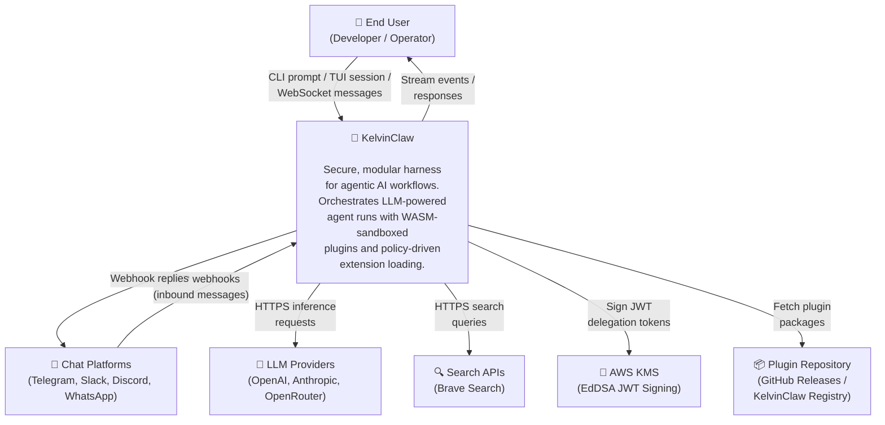

# C4 Level 1 — System Context

> Who uses KelvinClaw and what external systems does it interact with?

## Legend

| Element               | Description                                                                                        |
| --------------------- | -------------------------------------------------------------------------------------------------- |
| **End User**          | Developer or operator interacting via CLI (`kelvin-host`), TUI (`kelvin-tui`), or WebSocket client |
| **Chat Platforms**    | External messaging services that send inbound webhooks to the gateway                              |
| **KelvinClaw**        | The entire KelvinClaw system — gateway, runtime, brain, memory, plugins                            |
| **LLM Providers**     | Third-party model inference APIs accessed through WASM model plugins                               |
| **Search APIs**       | External search services accessed through WASM tool plugins                                        |
| **AWS KMS**           | Key Management Service used for signing memory delegation JWT tokens                               |
| **Plugin Repository** | Source for installable plugin packages (`.tar.gz` with manifests and WASM payloads)                |
