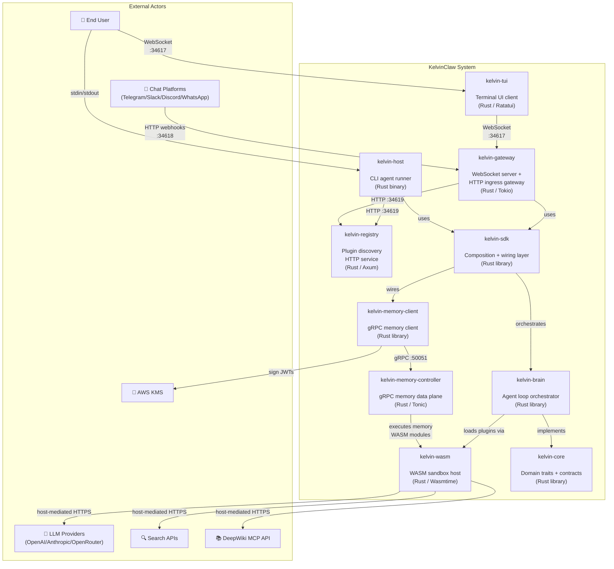
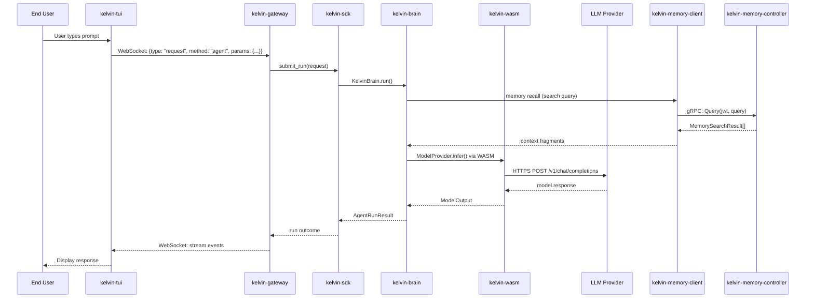

# C4 Level 2 — Container Diagram

> What are the deployable units and how do they communicate?

## Container Overview

## Container Descriptions

| Container                    | Technology                 | Port(s)                    | Purpose                                                                                                                                                                                   |
| ---------------------------- | -------------------------- | -------------------------- | ----------------------------------------------------------------------------------------------------------------------------------------------------------------------------------------- |
| **kelvin-gateway**           | Rust / Tokio / Tungstenite | `:34617` WS, `:34618` HTTP | Primary long-running service. WebSocket API for clients, HTTP ingress for chat platform webhooks. Manages sessions, scheduling, idempotency.                                              |
| **kelvin-host**              | Rust CLI binary            | —                          | Thin CLI for single-prompt or interactive agent runs. Direct user-facing.                                                                                                                 |
| **kelvin-tui**               | Rust / Ratatui             | —                          | Terminal UI that connects to gateway over WebSocket.                                                                                                                                      |
| **kelvin-registry**          | Rust / Axum HTTP           | `:34619`                   | Optional plugin discovery and index query service.                                                                                                                                        |
| **kelvin-memory-controller** | Rust / Tonic gRPC          | `:50051`                   | Memory data plane. Validates JWT delegation tokens, executes WASM memory modules, replay protection.                                                                                      |
| **kelvin-sdk**               | Rust library               | —                          | Composition layer wiring brain, memory, plugins, sessions, and runtime config. Includes ToolPack built-in tools (fs read/write, web fetch, scheduler, session). Used by gateway and host. |
| **kelvin-brain**             | Rust library               | —                          | Agent loop: prompt → model → tool → persist. Plugin loading and execution.                                                                                                                |
| **kelvin-wasm**              | Rust / Wasmtime            | —                          | Trusted WASM sandbox host. Executes untrusted model, tool, channel, and memory plugins.                                                                                                   |
| **kelvin-core**              | Rust library               | —                          | Pure domain models and trait contracts. Zero external dependencies. The stable API surface.                                                                                               |
| **kelvin-memory-client**     | Rust library               | —                          | gRPC client implementing `MemorySearchManager`. Mints JWT delegation tokens.                                                                                                              |

## Communication Protocols

