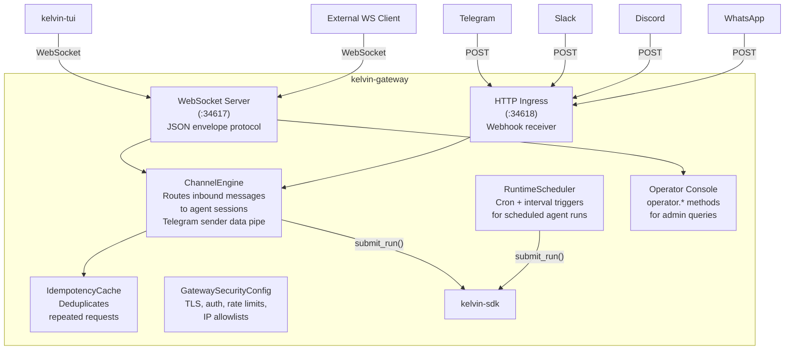
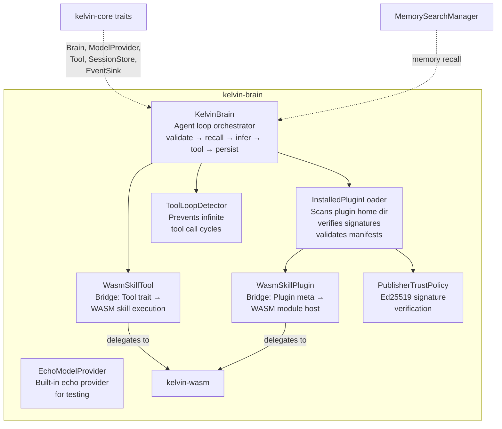
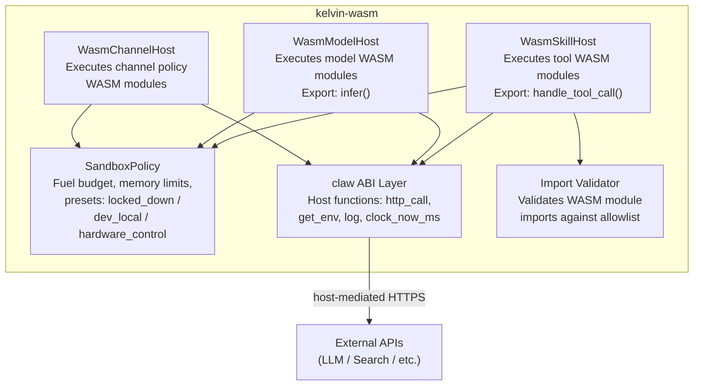
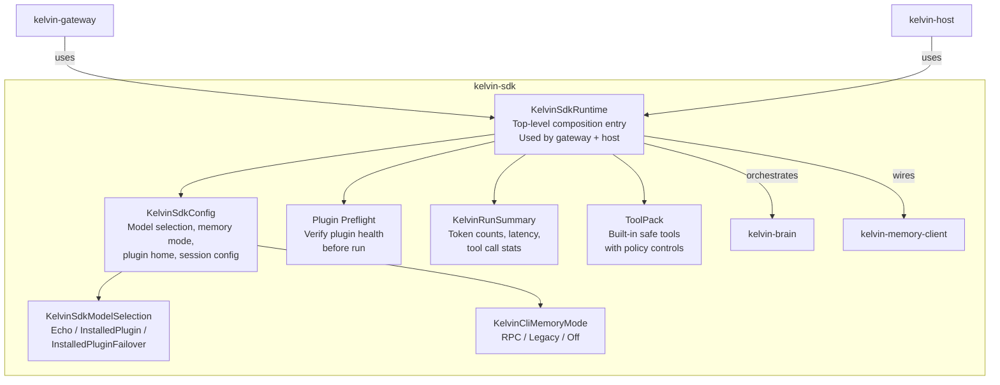
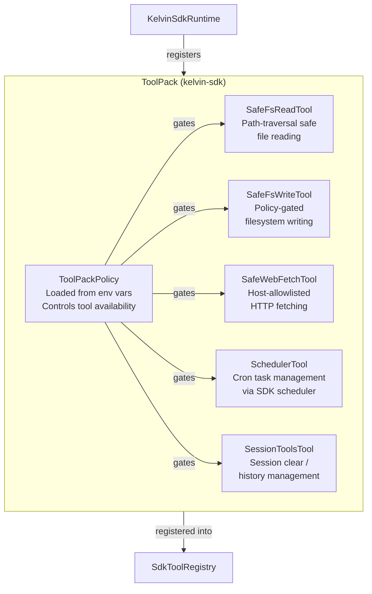
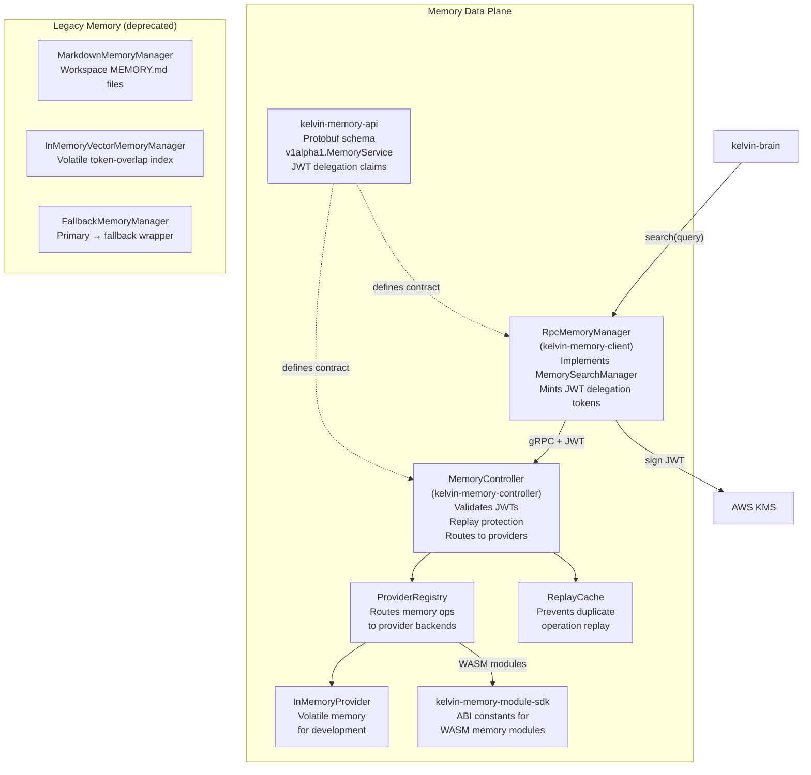
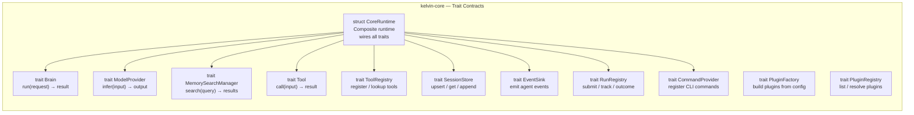

# C4 Level 3 — Component Diagrams

> What are the key components inside each container?

## kelvin-gateway Components

## kelvin-brain Components

## kelvin-wasm Components

## kelvin-sdk Components

## ToolPack Built-in Tools

## Memory Subsystem Components

## kelvin-core Components

