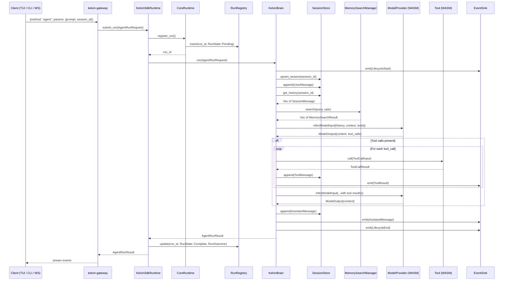
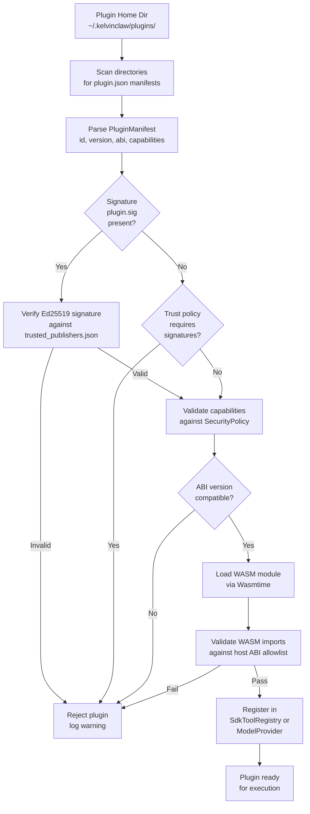
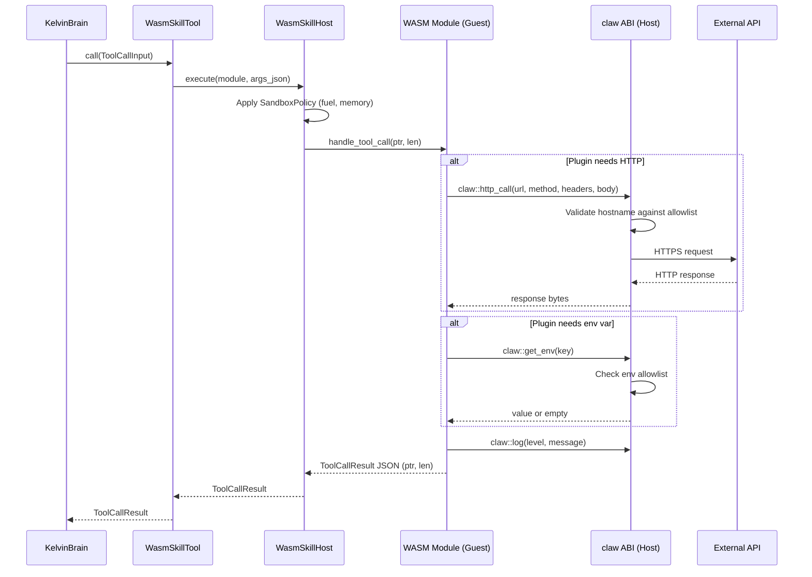
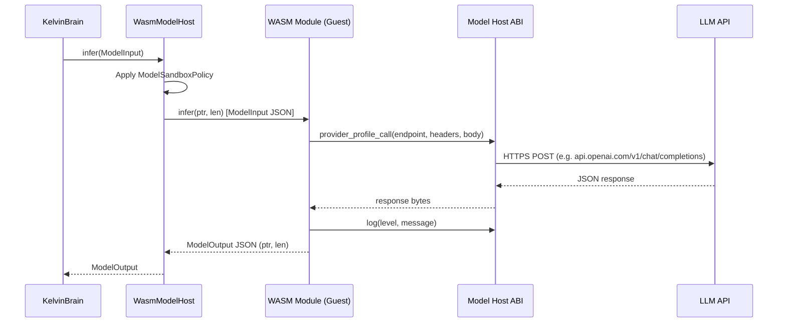
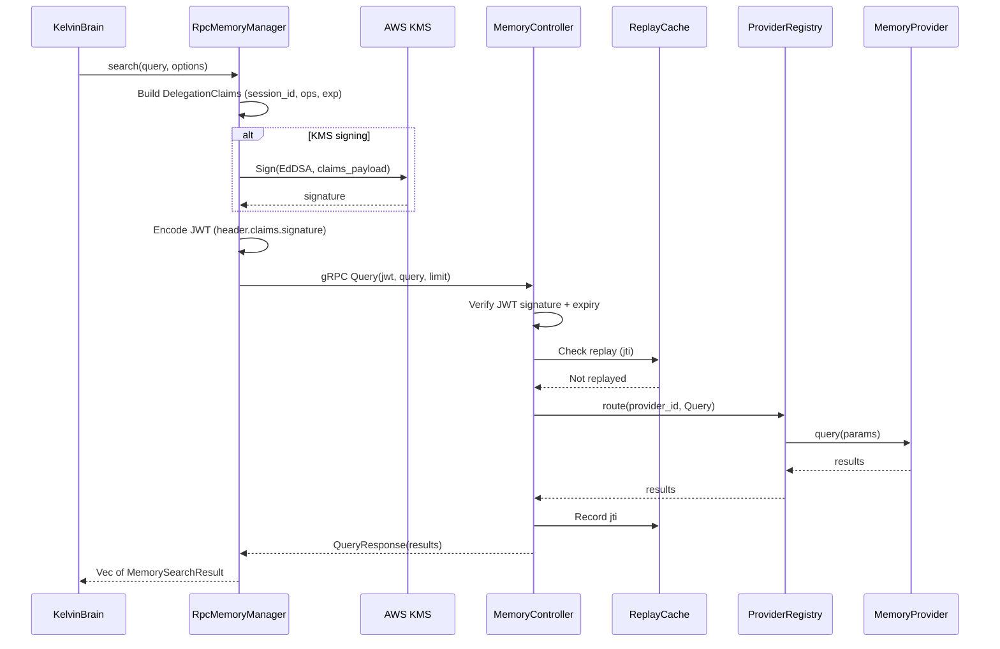
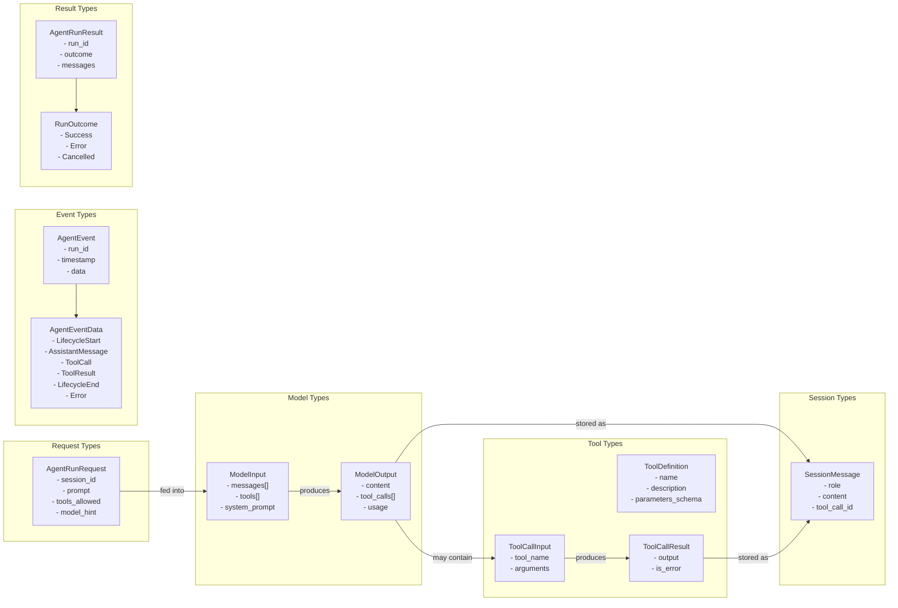

# C4 Level 4 — Code Diagrams

> Key code-level flows and type relationships.

## Agent Run Execution Flow

## Plugin Loading Flow

## WASM Tool Plugin Execution

## WASM Model Plugin Execution

## Memory RPC Flow

## Core Type Relationships

