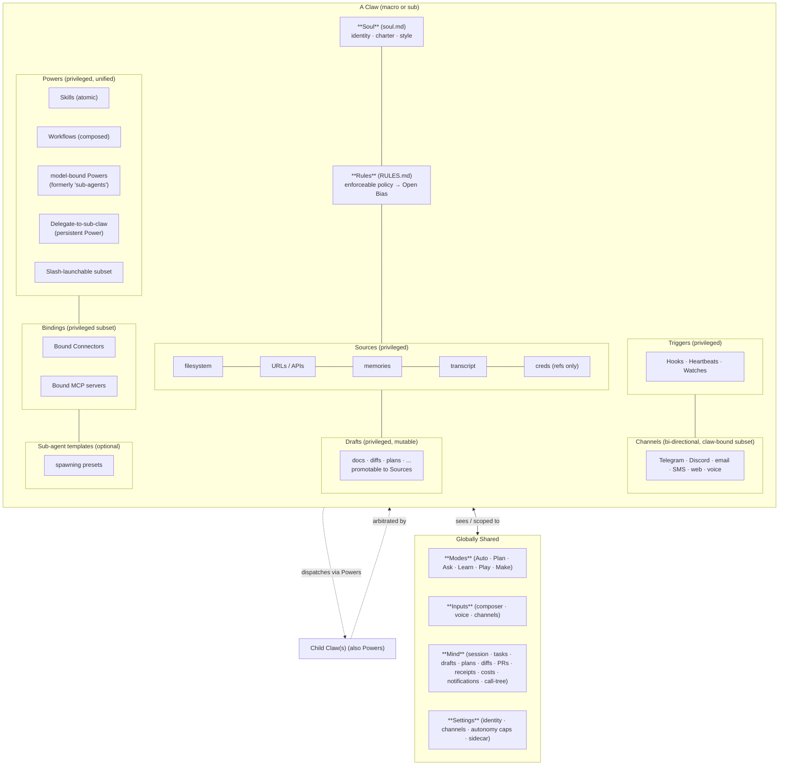

# Anatomy of a Claw

A **Claw** is the recursive primitive of the Kelvin GUI architecture. Every
claw — the macro claw (Kelvin) and every sub-claw (Health, Work, Personal,
Finance, …) — has the same anatomy. This doc is the source of truth for
what a claw is and what it owns.

See [ADR-005](decisions/005-recursive-claw.md) for the rationale behind the
recursive design.

## Diagram



## Privileged anatomy (per claw)

Each claw owns the following. "Privileged" means: scoped to this claw, not
shared with sibling claws unless explicitly bound.

### 1. Soul (`soul.md`)

A single human-readable markdown file holding the claw's identity, charter,
and style.

- **Identity**: name, one-line purpose
- **Charter**: what this claw is for, what it explicitly is not for
- **Style**: tone, verbosity, formatting preferences
- **Optional**: starting notes, vocabulary, examples

Loaded by the GUI for display/editing, and by the kelvinclaw runtime as the
claw's primary system prompt seed. See
[ADR-006](decisions/006-soul-rules-files-and-question-reuse.md).

### 2. Rules (`RULES.md`)

A single markdown file holding enforceable policy in
[Open Bias](https://github.com/open-bias/open-bias)'s format. Enforced at the
**model boundary** by the Open Bias sidecar (see
[07-sidecars.md](07-sidecars.md)).

Selected per request via header from kelvinclaw's `ModelProvider` shim — see
[interfaces/sidecar-integration.md](interfaces/sidecar-integration.md).

### 3. Sources

Privileged read inputs to the claw. Each source has a type and an optional
trust score (v2). In v1 the source type taxonomy is:

| Type | Description |
|---|---|
| `filesystem` | Mounted paths the claw can read |
| `web` | URLs / allowed domains |
| `api` | Raw API endpoints |
| `feed` | RSS / push feeds |
| `memory` | Per-claw `.md` memory store |
| `transcript` | The claw's own session history (recallable) |
| `connector-backed` | Source backed by a bound Connector (e.g., "Inbox via Gmail") |
| `mcp-resource` | Source backed by a bound MCP server's resource |

Per-source per-session approval, long-lived approval, or auto-allow depends on
the autonomy posture (see
[05-autonomy-postures.md](05-autonomy-postures.md)).

### 4. Drafts

Privileged mutable outputs. Drafts are the **only outbound write target** for
the agent layer; Sources are not directly writable. Drafts may be **promoted**
to one or more Sources via an explicit promotion action — the only
outbound-from-privileged edge, per
[ADR-007](decisions/007-drafts-promotion-edge.md).

A Draft's status: `'generating' | 'ready' | 'promoted'`. When promoted, it
gains back-references to the resulting Source entries; the Draft itself is
not deleted (audit trail).

### 5. Powers

The claw's library of capabilities. Each Power is a **Skill** (atomic) or a
**Workflow** (composed). A Power MAY bind its own model (formerly
"sub-agent"), MAY require Sources / Tools / Connectors / MCP servers (via
its `requires` field).

A special kind of Power: **Delegate-to-sub-claw** — a persistent Power that
hands off to a peer claw. The macro claw's library typically contains one
such Power per active sub-claw.

See [02-concepts-disambiguated.md](02-concepts-disambiguated.md) for the
full Power vs Connector vs MCP vs Sub-agent disambiguation.

### 6. Triggers

Three flavors per [ADR-008](decisions/008-three-postures-cap-invariant.md):

- **Hooks** — event-driven (e.g., "when email from X arrives…")
- **Heartbeats** — timer-driven (e.g., "every morning at 7am…")
- **Watches** — state-driven (e.g., "when calendar changes…")

Triggers fire at the claw's posture, NOT the user's session posture, because
the user is typically absent. The "Routines firing user-absent" autonomy
matrix axis allows further restriction of trigger-driven actions.

### 7. Channels (bound subset)

A claw's bound subset of installed Channels. Channels are bi-directional:

- **Inbound**: where Kelvin receives prompts (Telegram, Discord, email, SMS,
  web, voice)
- **Outbound**: where Kelvin can send via Powers (same surfaces, separately
  permissioned)

A claw may have asymmetric bindings (inbound from a webhook, no outbound).

### 8. Bound Connectors and Bound MCP servers

Subsets of the globally installed Connectors and MCP servers that this claw
can use. **A claw can only bind what its parent has bound** (subset
invariant per [ADR-005](decisions/005-recursive-claw.md)).

A Power inside the claw with `requires.connectors: [...]` can only function
if those Connectors are bound to the claw.

### 9. Sub-agent templates (optional)

Per-claw presets for spawning common Sub-agents. Each template carries:

- A role name ("Researcher", "Critic", …)
- A system prompt seed
- A default Powers allowlist
- A default budget (tokens, $, wallclock)

Templates are **optional convenience**, not required for spawning. A claw
with zero templates can still spawn Sub-agents on the fly. See
[ADR-001](decisions/001-sub-agents-runtime-only.md).

### 10. Autonomy posture

Per claw, capped by parent. See
[05-autonomy-postures.md](05-autonomy-postures.md) for the full matrix.

## Globally shared (NOT on the claw)

These live in the Settings / UI layer and every claw sees them via context.
They MUST NOT be added to the Claw schema. This separation makes the
recursive primitive clean.

### Modes

Composer-level intent picker: **Auto**, **Plan**, **Ask**, **Learn**, **Play**,
**Make**. Orthogonal to autonomy. See
[04-modes.md](04-modes.md).

### Inputs

The composer (text), voice input, and channel ingress. Globally shared
because the user composes once; Kelvin routes the message to the appropriate
claw.

### Mind

The observability surface. Tabs:

- **Session** — current chat
- **Tasks** — active and queued
- **Drafts** — produced artifacts (with promotion targets)
- **Plans** — multi-step strategies
- **Diffs** — file changes pending or applied
- **PRs** — pull request status (when a Connector is wired)
- **Browser** — live browsing surface (v2)
- **Receipts** — immutable audit log
- **Costs** — token / $ / time spend per claw
- **Notifications** — async pings from completed work or Routines

Plus the **call-tree** view for delegation (see
[03-delegation-and-call-tree.md](03-delegation-and-call-tree.md)).

Full spec: [08-mind.md](08-mind.md).

### Settings

Global config:

- **Identity** (single user in v1; ADR-004)
- **Channels** (install + configure inbound/outbound surfaces)
- **Connectors** (install + auth Composio apps, OAuth providers)
- **MCP servers** (install + configure local + remote)
- **Sidecar** (Open Bias `:4000` config, fail-closed toggle, RULES.md
  inheritance)
- **Autonomy** (user-cap default for all claws)
- **Cost & budgets** (global)
- **Versioning** (git remote for soul.md / RULES.md tracking)

The settings nesting:

```
Settings (global)
├── Identity
├── Channels
├── Connectors                       ← Composio + OAuth providers
├── MCP servers                      ← local + remote
├── Sidecar                          ← Open Bias :4000, RULES inheritance, fail-closed
├── Autonomy (User cap)
├── Cost & budgets
└── Versioning / git remote

Per-Claw (macro & each sub-claw, identical shape — ADR-005)
├── Soul.md
├── RULES.md
├── Sources                          ← privileged
│   ├── Filesystem
│   ├── Web
│   ├── APIs
│   ├── Feeds
│   ├── Memories
│   ├── Transcript
│   ├── Connector-backed
│   └── MCP-resources
├── Drafts                           ← privileged, mutable; promotable to Sources
├── Powers                           ← privileged
│   ├── Skills (atomic)
│   ├── Workflows (composed)
│   └── Delegate-to-sub-claw (persistent)
├── Bound Connectors                 ← subset of installed
├── Bound MCP servers                ← subset of installed
├── Triggers                         ← Hooks · Heartbeats · Watches
├── Channels (bound subset)
├── Sub-agent templates (optional)
└── Autonomy posture (capped by parent)
```

## Recursion guarantee

> Any claw can spawn child claws. A child claw is a `Claw` record with
> `parentClawId` set. The same component, the same wizard, the same posture
> picker, the same Soul/Rules editing UI applies at every depth.

The macro claw is identifiable only by `parentClawId === null`. Code that
needs "the root" uses a derived selector in the Zustand store, not a
positional flag.

Privilege invariants (formalized in
[ADR-008](decisions/008-three-postures-cap-invariant.md)):

- `child.autonomyPosture <= parent.autonomyPosture` along every axis
- `child.boundConnectorIds ⊆ parent.boundConnectorIds`
- `child.boundMcpServerIds ⊆ parent.boundMcpServerIds`
- A child claw may NOT bind a Connector or MCP server the parent has not bound
- Arbitration flows up: a parent chief judges between its sub-chiefs/sub-claws
  when they disagree

## Promotion edge — the only outbound

Drafts → Sources is the single outbound write path from privileged to durable
state. See [ADR-007](decisions/007-drafts-promotion-edge.md). The autonomy
matrix's "Drafts → Sources promotion" row gates this edge.

## Cross-references

- [ADR-005](decisions/005-recursive-claw.md) — recursion rationale
- [ADR-007](decisions/007-drafts-promotion-edge.md) — promotion edge
- [02-concepts-disambiguated.md](02-concepts-disambiguated.md) — Power /
  Connector / MCP / Sub-agent
- [05-autonomy-postures.md](05-autonomy-postures.md) — posture matrix
- [09-data-model.md](09-data-model.md) — `Claw` schema
- [10-h02-migration.md](10-h02-migration.md) — Space → Claw migration
